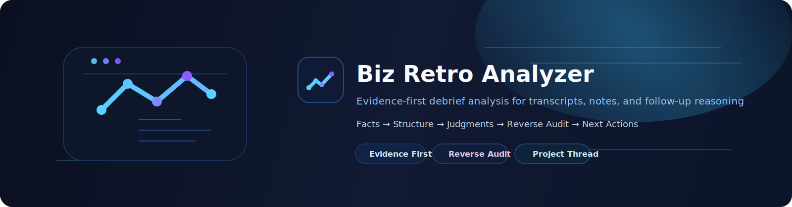

<p align="right">
  <a href="./README.md"><strong>English</strong></a> | <a href="./README.zh-CN.md">简体中文</a>
</p>



# Biz Retro Analyzer

Evidence-first dialogue intelligence for messy project conversations.

`biz-retro-analyzer` is a reusable agent skill for turning raw project conversations into structured facts, influence chains, judgment audits, and next actions.

Use it when the important question is not only "what was said?", but:

- which facts are actually supported
- which claims are participant assertions
- who understands the problem, advancement path, constraints, and decision mechanics
- who introduced a frame, who adopted it, and who made it actionable
- which judgments are strong, weak, or still need validation
- what should happen next

It is designed for conversation-heavy work in complex collaborative projects where ordinary summaries are too smooth and too shallow.

---

## Quick Start

Use this skill when you have messy source material and want an evidence-aware retro instead of a generic summary.

Copy this prompt into your agent or model run:

```md
Use biz-retro-analyzer / Mode C: Audit Pack.

Input stack:
- Source evidence: [paste transcripts, meeting notes, field notes, or observation notes]
- Context: [briefly explain the project and current concern]
- Later reasoning: [optional; paste follow-up analysis or hypotheses separately]

Please produce:
1. Structured Fact Record
2. Project Thread
3. Advancement / Influence Chain
4. Participant Understanding Map
5. Judgment and Reverse Audit
6. Current Actions

Rules:
- Separate facts, participant claims, and model inferences.
- Tag high-impact judgments with Status, Strength, Basis, and Source anchor.
- Treat suspicious or contradictory actions as diagnostic signals, not automatic proof of bad faith.
- Do not treat later reasoning as source evidence.
```

For a lighter run, use `Mode A: Fact Pack`.  
For a full retro, use `Mode B: Retro Pack`.  
For a harder review of an existing story, use `Mode C: Audit Pack`.

Project status:

- License: MIT, see `LICENSE`.
- Roadmap: see `ROADMAP.md`.
- Evaluation guide: see `EVALUATION.md`.
- Synthetic adversarial case: see `evaluations/adversarial-dialogue-werewolf/`.

---

## What This Is

This is **not** a transcription tool and **not** a generic meeting-summary template.

It is an **evidence-first dialogue intelligence skill** for turning raw conversation material into reusable analysis artifacts about participant understanding, project advancement, influence chains, judgment risk, and next-step action.

The skill is especially useful when you have:

- multiple meetings
- different kinds of source material
- mixed fact and interpretation
- layered stakeholder dynamics
- evolving trial scenarios and direction
- multi-party coordination, negotiation, or advancement friction

---

## The Werewolf Test

The repository includes **The Werewolf Test**, a synthetic hidden-role dialogue evaluation case.

Werewolf is used here as a toy problem for complex dialogue analysis. It creates a compact version of the same risks that appear in messy project conversations:

- public claims are not facts
- confident speakers can be wrong
- weak speakers can be right
- authority can be transferred
- suspicious actions can be mistakes rather than bad faith
- the outcome depends on who turns a narrative into action

The point is not to solve the game. The point is to test whether the skill can preserve evidence discipline under hidden incentives.

See `evaluations/adversarial-dialogue-werewolf/`.

---

## Best Fit Scenarios

Use this skill for:

- post-meeting debriefs
- partnership or collaboration reviews
- project progression analysis
- complex project advancement analysis
- complex multi-party retros
- field observation plus meeting-note synthesis
- "what actually happened, what changed, and what should we do next?" analysis

Examples:

- analyzing several meeting transcripts after an important working session
- turning notes, recordings, and observations into a coherent project thread
- auditing whether a current narrative is actually supported by evidence
- identifying who introduced a frame, who inherited it, and who changed the next-step path
- distinguishing a trial scenario from the broader system or product body

---

## Not a Good Fit

Do **not** use this as your main tool for:

- plain meeting minutes
- simple action-item extraction
- sentiment analysis
- generic sales-call scoring
- raw transcription only
- purely emotional or conversational tone review

If all you need is "summary + next steps", this skill is probably too heavy.

---

## Core Design

This skill follows six principles:

1. **Evidence first**  
   Source materials are preserved before interpretation.

2. **Facts before judgments**  
   Structured source records come before conclusions.

3. **Claims are not facts**  
   What a participant says, asserts, implies, or believes stays separate from what the source actually confirms.

4. **Understanding depth matters**  
   The output distinguishes what people want from what they actually understand.

5. **Influence chains matter**  
   The output identifies how a frame, claim, authority, or next-step path becomes actionable across participants.

6. **Reverse audit when needed**  
   If the story feels too smooth or too confident, it stress-tests the conclusions.

---

## Input Model

The skill supports layered inputs.

### Layer 1: Source Evidence

At least one of:

- transcript
- meeting notes
- field observation notes
- video analysis text

If the user starts with audio, transcribe it first into a usable transcript before deeper analysis.

Also classify the interaction context when possible. Useful labels include:

- `formal_meeting`
- `working_session`
- `informal_debrief`
- `private_side_conversation`
- `asymmetric-awareness conversation`

These contexts matter because informal or asymmetric-awareness materials can be highly revealing while also being unstable. They are useful for understanding concerns, constraints, and coordination risks, but should not be treated as stable intent, formal policy, or commitment without cross-source support.

### Layer 2: Context (optional)

- project or task background
- collaboration setup
- user concerns
- sketches or hypotheses

### Layer 3: Follow-up Reasoning (optional)

- AI analysis conversation
- retrospective discussion
- intermediate conclusions
- correction / revision dialogue

Important: follow-up reasoning is treated as **judgment-layer input**, not source evidence.

### Ethical scope for asymmetric-awareness materials

This skill may analyze informal or asymmetric-awareness project materials only for project-relevant understanding, coordination, risk, incentive, and decision analysis.

It should not be used to produce:

- personality profiling
- non-project personal exploitation strategies
- manipulative guidance based on people speaking without symmetric awareness

Judgments derived mainly from these materials should stay narrow, internally scoped, and validation-seeking.

### Team dynamics analysis vs personality profiling

Analyzing how a team works together is **allowed and often essential** — this includes communication style mismatch, decision-authority asymmetry, trust gaps, false consensus, and collaboration friction.

The boundary is: **analyze how people work together (allowed) vs analyze who people are (not allowed).**

Keep team-dynamics observations tied to observable behavior and project outcomes, not to fixed character traits.

---

## Output Model

Depending on the input depth and request, the skill produces one or more of:

1. **Structured Fact Record**
2. **Retro / Project Thread**
3. **Advancement / Influence Chain**
4. **Participant Understanding Map**
5. **Judgment and Reverse Audit**
6. **Current Actions**
7. **Method Notes**

The goal is to separate:

- what is confirmed
- what is asserted
- what is inferred
- what is still missing
- what should happen next

### HTML Output Mode

The skill now also supports an `HTML` report mode when the output needs to be:

- shareable as a standalone page
- easier to scan visually than Markdown
- structured as evidence layer + thread + audit + actions

The HTML mode is driven by:

- `references/html-output-mode.md`
- `references/output-schema.json`
- `assets/html-report-template.html`
- `assets/html-report.css`

The user does not need to know this mode exists in advance.  
The skill can recommend HTML near the end of the analysis when the output has enough structure to benefit from a shareable page.

### Evidence Tagging

The skill supports a lightweight evidence-tagging convention for important conclusions:

- `Status`: `Confirmed` / `Inferred` / `Assumption` / `Needs validation`
- `Strength`: `High` / `Medium` / `Low`
- `Basis`: `Source quote/paraphrase` / `Cross-source pattern` / `User context` / `Later reasoning only`
- `Source anchor`: brief meeting, material, speaker, or segment reference for high-impact claims

This is especially useful when the output includes:

- stakeholder motive readings
- project-boundary calls
- pricing or leverage judgments
- commitment-shaping next actions
- claims about who controls the decision path
- explanations of suspicious or contradictory behavior
